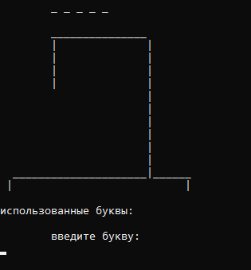

Правила игры:
Компьютер загадывает случаное слово из списка. Игрок должен угадать данное слово, угадывая его по одной букве. Игрок выйграл, если угадал слово полностью. Проиграл если допустил 6 ошибок. Одна неверно угаданная буква - одна ошибка.
Особенности:
1. Слово выбирается компьютером из списка слов (100 слов).
2. Список слов находится в файле в зашифрованном виде.
3. По завершении игры на экран выводится статистика игры:
• количество времени;
• количество попыток;
• искомое слово;
• буквы игрока.

Rules of the game:
The computer makes a random word from the list. The player must guess the given word by guessing it by one letter. The player won if he guessed the word completely. I lost if I made 6 mistakes. One incorrectly guessed letter is one mistake.
Features:
1. The word is selected by the computer from the list of words (100 words).
2. The list of words is in the file in encrypted form.
3. At the end of the game, the game statistics are displayed on the screen:
• amount of time;
• number of attempts;
• the search word;
• player letters.

